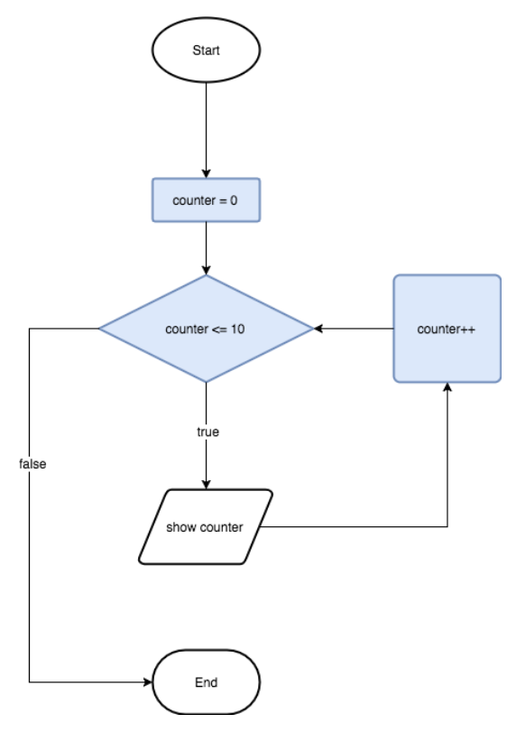
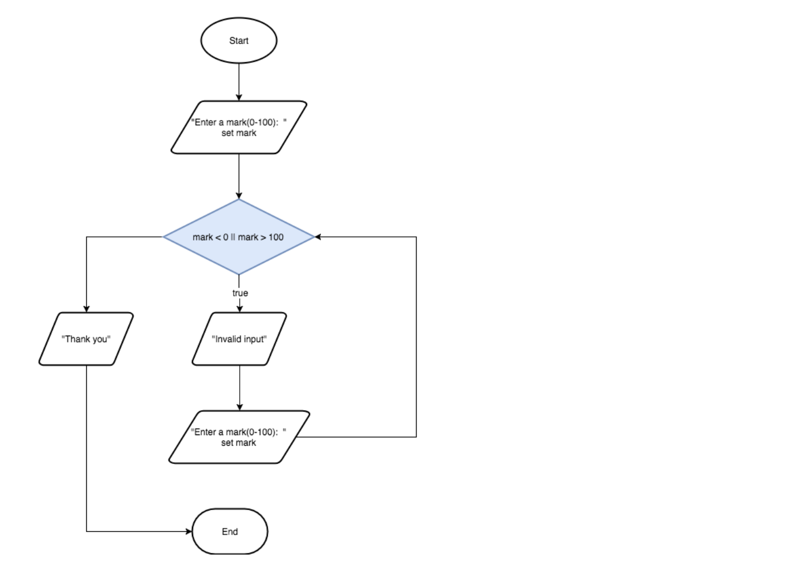

# 2.5 While Loops


Recall when we looked at for loops, a flowchart that visualizes the sequence and logic of this control structure looked like this:

In this chart for a program that counts from 0 to 10, the blue block represent the 3 components of a for statement.


```
for (int counter = 0; counter <= 10; counter++){
    System.out.println(counter);
}
```


If we break down the parts of a for statement based on purpose, we have


<table>
  <tr>
   <td><code>int counter = 0</code>
   </td>
   <td>initialize the counter variable
   </td>
  </tr>
  <tr>
   <td><code>counter &lt;= 10</code>
   </td>
   <td>the continue condition
   </td>
  </tr>
  <tr>
   <td><code>counter++</code>
   </td>
   <td>increment the counter variable.
   </td>
  </tr>
</table>


A for loop is a special kind of loop based on counting, called a **counted loop**, one that is to iterate (cycle through) a certain amount of times.


## Conditional Loops - `while` Loops

Another type of loop is a `while` loop, which is a loop that iterates as long as a condition remains true.  This is known as a conditional loop.   Whereas for loops are performed a specific number of times, while loops are more flexible and can run any number of times as long as the condition is true.


### General Form


```
while (boolean expression){
    … // some code
}
```

### Example 1:  Reproducing a Counted Loop

Write the Count To Ten program above as a while loop.


```
/**
* Count to 10 using a while loop.
* @author: E. Fabroa
*
*/

public class WhileCount10 extends ConsoleProgram {

   public void run() {


       int counter = 0;


       while (counter <= 10){
           System.out.println(counter);
           counter++;
       }
   }
}
```


 


### Infinite Loops

Infinite loops are loops that will run forever because the boolean expression of the loop (the continue condition) always remains true.  This usually occurs because code within the loop does not work towards a `false` value for the continue condition.


### Example 2: Infinite Loop
In the code "count to 10" program above, comment out the counter ++.  What happens? Why does it happen?


## User Input Data Validation
We can use while loops to verify that users are entering correct input. 


### Example 3 - Data Validation
Write a program that prompts the user to enter a mark.   The mark must be between 0 and 100.  Keep prompting for a mark until a valid input is inputted.




```
package unit2;
import codehs.ConsoleProgram;

/**
* Count to 10 using a while loop.
* @author: E. Fabroa
*
*/

public class DataValidation1 extends ConsoleProgram {

   public void run() {

       double mark = readDouble("Enter a mark (0-100): ");

       while (mark < 0  || mark > 100){
           System.out.println("Invalid input.");
           mark = readDouble("Enter a mark (0-100): ");
       }

       System.out.println("Thank-you!!");
   }
}
```

### Example 4 - Data Validation
Write a program that displays a menu with 3 options labelled A, B, C, and prompts the user to input their choice.  If they enter an invalid option, show a "invalid input" message and prompt for a choice.  Keep repeating until a valid choice is entered.


```
Beverage Menu
a. Coffee
b. Bottled Water
c. Chocolate Milk

Choose a beverage:  d
Invalid input, please choose a, b, or c
Choose a beverage:  e
Invalid input, please choose a, b, or c
Choose a beverage:  b
Great choice!!
```
```
/**
*A program that prompts for a valid mark
* @author: E. Fabroa
*
*/

public class MenuValidation extends ConsoleProgram {

   public void run() {

       System.out.println("Beverage Menu");
       System.out.println("a. Coffee");
       System.out.println("b. Bottled Water");
       System.out.println("c. Chocolate Milk");

       // get choice
       char choice = readLine("Choose a beverage: ").charAt(0);

       while (choice != 'a' && choice != 'b' && choice != 'c'){
           System.out.println("Invalid input");
           choice = readLine("Choose a beverage: ").charAt(0);
       }
   }
}
```
